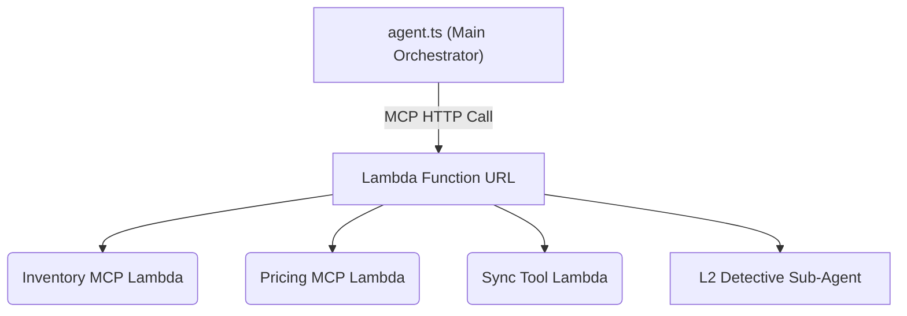
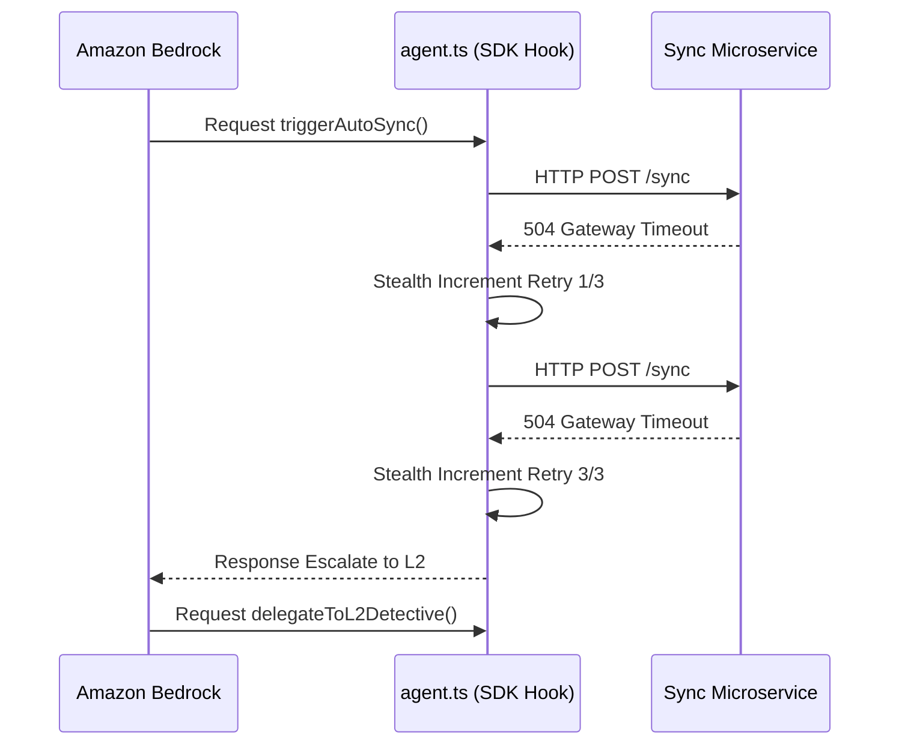
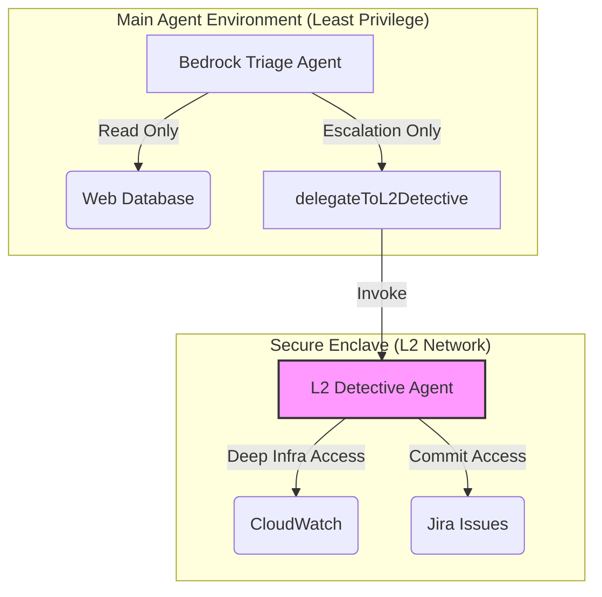

# 🏗️ AgentCore Operations Hub Architecture

This document provides a deep-dive technical overview for engineering peers, reviewers, and systems architects detailing the Model Context Protocol (MCP) mesh, the core reasoning loop, and the serverless infrastructure.

---

## ⚙️ The Distributed MCP Mesh

Unlike traditional monolithic agents that run all logic inside a single prompt or local filesystem process, this architecture uses a **Distributed Serverless Mesh** powered by the Model Context Protocol (MCP).

### Why MCP over standard function calling?
1. **Separation of Concerns:** Each backend service (Inventory, Price, Sync) is an isolated AWS Lambda function. The core agent does not need to know *how* `checkInventory` works, only its schema.
2. **Independent Scaling:** If the Sync Service requires heavy IOPS, it can be scaled and provisioned with more memory independently of the L2 Detective Service.
3. **Language Agnostic:** Because they communicate via standard MCP over HTTP/JSON, future sub-agents could easily be written in Python or Go without disrupting the TypeScript orchestrator.

---

## 🧠 The "Self-Healing" Retry Lifecycle

The most advanced piece of the orchestrator is its fault-tolerance mechanism built into `@strands-agents/sdk` hooks. 

### The Flow:
1. **Pre-Execution (`BeforeToolCallEvent`):** Business logic safety checks. For instance, the system hooks into `triggerAutoSync` and dynamically blocks executions during "Holiday Freeze" windows to prevent accidental production deployments.
2. **Observation:** The Agent attempts to invoke an upstream MCP service.
3. **Error Interception (`AfterToolCallEvent`):** If a `504` or `503` occurs, the orchestrator hides this from the LLM. It increments a local tracker in `appState`.
4. **Silent Loop:** The orchestrator re-fires the network request up to 3 times sequentially. 
5. **Deterministic Escalation:** On the 4th failure, the orchestrator injects a synthetic "Failure Payload History" back into the LLM's context window. This strict prompting forces the AI to abandon the current strategy and immediately invoke `delegateToL2Detective`.

### 🔄 The Hook Execution Loop

---

## 🕵️‍♂️ Agent-to-Agent (A2A) Encapsulation

**Problem:** Giving a single multi-purpose LLM access to 50 tools leads to massive context bloat (expensive token usage) and high risk of "Tool Hallucination" (using a Jira checking tool when asked to check the price).

**Solution:** The principle of Least Privilege via Sub-Agents.

### 🛡️ Security Boundaries (Component View)

*   **The Triage Agent:** Only knows how to read web databases, pull inventory, and trigger syncs. It has *no idea* what CloudWatch or Jira are.
*   **The L2 Detective Agent (`L2DetectiveService.ts`):** An independent instantiation of a Bedrock Agent. It holds the private registry of infrastructure tools (`checkCloudTrailLogs`, `checkJiraCommits`). 

The Triage Agent acts merely as a router, invoking the L2 Detective when triaging hits a dead-end, keeping the context windows clean and costs minimized.

---

## 🗺️ Scale-Out Roadmap

While currently running 11 deterministic MCP tools, the next architectural iteration targets:

1. **Dynamic Tool Discovery (RAG for Tools):** Storing MCP Server definitions in a Bedrock Knowledge Base vector store. The `agent.ts` will dynamically route semantic intent to the top 5 relevant tools, allowing the mesh to scale to 100+ microservices without hitting token limits.
2. **Multi-Model Orchestration:** Introducing a lightweight intent router (Claude 3.5 Haiku) to handle simple queries, only waking up the heavy lifter (Claude 3.5 Sonnet) for deep RCA (Root Cause Analysis).
3. **Cross-Model Verification:** Replacing the native LLM-as-a-Judge with competing Open Weights models (e.g., Llama 3) for unbiased evaluation suite grading.
