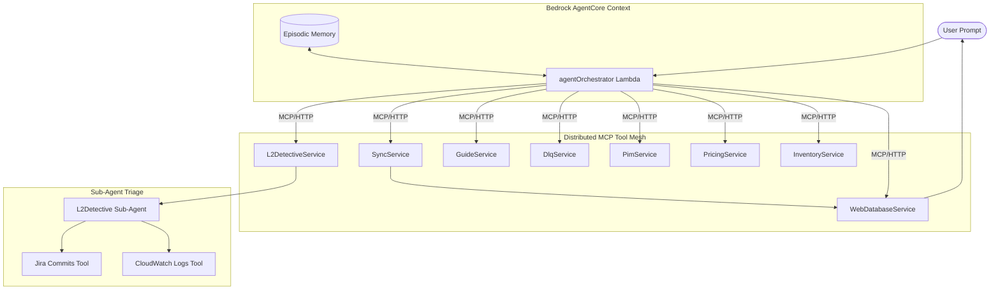

# 🚀 Bedrock AgentCore Operations Hub — Multi-MCP Architecture

An enterprise-grade **Autonomous Operations Hub** built on **Amazon Bedrock AgentCore**. This version has been re-architected into a **Fully Distributed MCP Micro-services Mesh**, with **11+ independent Service Lambdas**, **Episodic Memory Recall**, and an **L2 Detective sub-agent**.

---

## 🛠️ Tech Stack & Patterns

| Layer | Technology |
|---|---|
| **Orchestration** | [@strands-agents/sdk](https://www.npmjs.com/package/@strands-agents/sdk) — Multi-agent graph orchestration |
| **Protocol** | **Model Context Protocol (MCP)** — Distributed tool discovery & execution |
| **Model** | **Amazon Bedrock** — Claude 3.5 Sonnet v2 (`20241022`) |
| **Compute** | **AWS Lambda (Node.js 22.x)** — Distributed 11+ Lambda architecture |
| **Memory** | **AgentCore Episodic Memory** — Vector-based history recall across sessions |
| **Observability** | **Correlation IDs** — End-to-end tracing across distributed services |
| **Validation** | **Zod** — Schema-validated environment & tool configurations |
| **Deploy** | **Serverless Framework v4** — Infrastructure as Code |

---

## 🏗️ Distributed Architecture

Unlike traditional monolithic agents, this system treats every tool as an independent micro-service. This allows for isolated scaling, independent timeouts, and specialized memory contexts.



---

## ✨ Key Features

### 🧠 Episodic Memory Recall
The system uses **Amazon Bedrock AgentCore** to remember past investigations. 
- **The Hook**: Before the agent starts, it retrieves the last 5 relevant episodes for the specific Project/SKU.
- **The Benefit**: If a product was fixed earlier but broke again, the agent anticipates the failure and skips redundant triage steps.

### 🔍 Distributed Observability (Correlation IDs)
Every request generates a unique **Correlation ID**. As the orchestrator calls various MCP Lambda services, this ID is propagated through headers and logs.
- Search `corr-xxxxxxxx` in CloudWatch to see the complete distributed trace of a single AI investigation.

### 🧑‍⚖️ LLM-as-a-Judge Evaluation
An automated evaluation suite that uses a secondary "Judge" model to score the agent's performance.
- Matches agent output against **Ground Truth**.
- **Structural Integrity Check**: Automatically penalizes scores if the agent missed calling expected tools (e.g., claiming a fix without calling `triggerAutoSync`).

### 🛡️ Compliance & Safety Interlocks
Active "Digital Supervisor" hooks protect production systems from high-risk AI choices:
- **No-Change Weekend**: The system uses a `BeforeToolCallEvent` hook to automatically block all `triggerAutoSync` calls from Friday 16:00 through the end of Sunday, preventing unmonitored weekend changes.
- **Stateful Self-Healing (Auto-Retry)**: A custom `afterToolCall` hook detects transient network failures (timeouts, 503/504) and automatically triggers a **Max-3 Retry** cycle using the agent's internal `appState`. The AI only sees the final success, ensuring 99.9% tool reliability.
- **Full Audit Trail**: Every "thought" and "action" is intercepted and logged to CloudWatch via **Strands SDK Hooks**, ensuring 100% transparency of the AI reasoning process.
- **Contextual Enrichment**: Intercepts low-price results (e.g. 0.00) and injects "Gift Item" metadata automatically to prevent the AI from misinterpreting correct data as a discrepancy.

---

## 🏆 Advanced Engineering Patterns (Why this isn't just a wrapper)

To solve the limitations of standard "monolithic" LLM agents, this project implements several enterprise-grade architectural patterns:

### 1. Agent-to-Agent (A2A) Encapsulation 🕵️‍♂️
Instead of giving the main agent `CloudWatch` and `Jira` API access—which risks expensive **"Tool Hallucination"**—the system uses an **Encapsulated Specialist**. 
- The Main Agent only has one escalation tool: `delegateToL2Detective`. 
- When invoked, a **separate, internally defined Bedrock Sub-Agent** spins up with its own private registry of infrastructure tools. 
- **Result**: The Main Agent stays hyper-focused on business logic triage, while the L2 sub-agent handles deep-dive root-cause analysis securely underneath the primary execution layer.

### 2. State-Aware "Silent" Self-Healing 🔄
Transient `504` and `503` network timeouts destroy standard agent reliability. Instead of relying on the LLM to figure out it needs to retry, or burying retry loops inside Lambda functions:
- A centralized **SDK Hook (`AfterToolCallEvent`)** intercepts the error.
- It tracks execution counts in the agent's isolated `appState` memory.
- It automatically re-fires the tool up to 3 times without telling the LLM, saving massive token costs.
- **Fail-Safe Handoff**: If all 3 silent retries fail, it drops a completely formatted *Execution History* into the LLM's context window, issuing a strict system override to trigger the L2 Escalation protocol.

---

## 📂 Project Structure

```bash
├── src/
│   ├── agent.ts                # Main orchestrator (builds tool mesh + logic)
│   ├── memory.ts               # Bedrock AgentCore memory integration
│   ├── logger.ts               # Structured logging + Correlation ID support
│   ├── config.ts               # Zod-validated environment configuration
│   ├── mcp-server-factory.ts   # Factory to turn any logic into an MCP service
│   ├── mcp-server/             # Individual Service Logic
│   │   ├── InventoryService.ts # Inventory specialist
│   │   ├── SyncService.ts      # Self-healing engine
│   │   ├── L2DetectiveService.ts # Special sub-agent for infra failures
│   │   └── ...                 # 8+ additional services
│   └── evaluator.ts            # LLM-as-a-Judge Eval Runner
├── config/
│   └── eval.json               # 9 complex evaluation scenarios
└── serverless.yml              # CloudFormation deployment for 11+ Lambdas
```

---

## 🚀 Getting Started

### 1. Installation
```bash
nvm use 22
npm install
```

### 2. Deployment
Ensure your AWS credentials are set and you have the required Bedrock models enabled.
```bash
npm run deploy
```

### 3. Run Evaluations
Run the comprehensive test suite to verify the agent's reasoning across all 9 scenarios.
```bash
npm run eval
```

---

## 🧠 Reasoning Cycle (The 5-Step Protocol)

The agent follows a strict operational loop defined in its system prompt:

1.  **Intent Extraction**: Classifies user complaint (Generic vs Specific).
2.  **Web State Triage**: Calls `checkWebDatabase` to get the source of truth for the site.
3.  **Upstream Investigation**: Queries flagged systems (Inventory, Price, or PIM) in parallel.
4.  **Autonomous Remediation**: Triggers `triggerAutoSync` + consults `queryGuide` on failure.
5.  **L2 Escalation**: If sync fails repeatedly, handoff to the specialized **L2 Detective**.
6.  **Verification**: Always re-checks the site after a fix to confirm `SELLABLE` status.

---

## 🚀 Scale-Out Roadmap: 50+ Tools

While the current **11-tool mesh** is optimized for low latency and high accuracy, the architecture is designed to scale to **hundreds of specialized MCP services** for massive enterprises.

### 🧠 Dynamic Tool Discovery (Bedrock Knowledge Base)
As the tool registry grows, we provide a "RAG for Tools" layer:
1.  **Index**: All Tool Metadata (name, description, schema) is indexed in a **Bedrock Knowledge Base**.
2.  **Retrieve**: When a user prompt arrives, a **pre-step Lambda** queries the KB for the top 5-10 most relevant tool definitions.
3.  **Inject**: The `agentOrchestrator` dynamically connects *only* to the relevant MCP servers for that specific task.
4.  **The Benefit**: This keeps the AI's context window clean, eliminates tool ambiguity, and significantly reduces token costs at scale.

---

## ✍️ Author
**Palamkunnel Sujith** — *AI & Serverless Architect*
- LinkedIn: [https://www.linkedin.com/in/sujithpvarghese/]

## ⚖️ License
MIT
